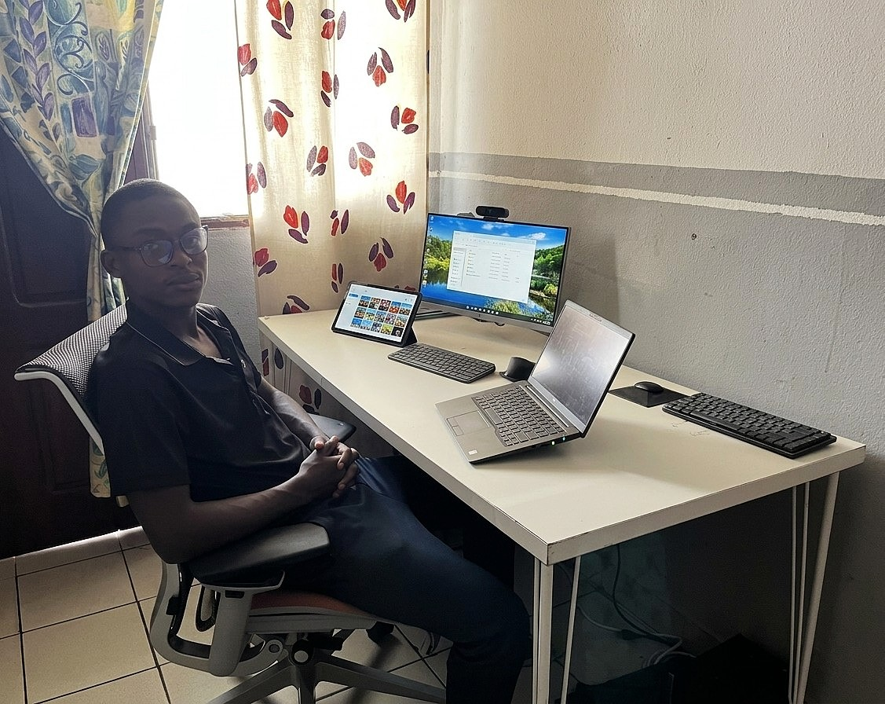

# Tiani Pekins

**Full-Stack Developer & Data Analyst**

Software Engineer focused on building scalable web applications and extracting insights from data. I bridge the gap between complex backend logic and intuitive frontend experiences, crafting production-grade systems across e-commerce, education, and IoT domains.

 
 
 
 

## My Workspace

  

## 🧑‍💻 About

I'm a full-stack engineer shipping production systems from REST APIs and real-time applications to responsive frontends and mobile apps. I combine backend expertise with frontend finesse to deliver complete solutions that scale

I've built and shipped:
- **E-commerce & Marketplace platforms** with payment processing and multi-vendor capabilities.
- **Event management systems** with ticketing, automation, and real-time dashboards.
- **IoT and smart home systems** sensors, microcontrollers, and hardware connected to intelligent web interfaces.
- **Smart systems & security infrastructure** CCTV networks, access control, and IoT-driven building automation
- **Productivity tools** leveraging data analysis and visualization.

Currently based in **Buea, Cameroon** 🌍

## 🛠️ Tech Stack

### 💻 Languages

  

> JavaScript · C++ · HTML5 · CSS3

### 🎨 Frontend

  

> React · React Native · Vite · Bootstrap · CSS3 · Responsive Design

### ⚙️ Backend & Runtime

  

> Node.js · NestJS · Prisma . REST APIs · Real-time Applications

### 🗄️ Databases

  

> PostgreSQL · MongoDB · MySQL 

### ☁️ DevOps & Cloud

  

> Docker · Git & GitHub · Firebase Hosting · Cloud Deployment · CI/CD Concepts

### 🔧 Hardware & IoT

  

> ESP8266 · Arduino · Embedded C++ · IoT Protocols & Sensor Networks . JAIN SLEE

### 🔒 Smart Systems & Security

  

> CCTV Installation & Configuration · IP Camera Networks · Home/Building Automation · Access Control Systems

###  📊  Data & Analysis

  

> Data Visualization · Analytics · Dashboard Development · SEO $ Performance Optimization

### 🔗 Integrations

  

> Payment Processing · Real-time Updates · Socket.io · Third-party APIs

## 📊 GitHub Stats

  
  

  

## 🚀 Featured Projects (Public)

| Project | Description | Stack |
|---------|-------------|-------|
| [**Local Hands**](https://github.com/Tpekins/local-hands) | Artisan-hiring marketplace connecting skilled workers with clients — location-based search, real-time bookings | React Native · Node.js · NestJS · PostgreSQL |
| [**Event Management System**](https://github.com/Tpekins/Event-Management-System) | Comprehensive event platform with ticketing, attendee registration, and organizer dashboard | PHP · MySQL · Java |
| [**Habit Tracking System**](https://github.com/Tpekins/Habit-Tracker) | Productivity tool with progress visualization, daily reminders, and streak tracking | React · Firebase |
| [**Digital Multi-Timezone Clock**](https://github.com/Tpekins/Tpekins/tree/main/digital-clock) | Real-time global clock display with 50+ timezones, dynamic timezone management | HTML5 · CSS3 · Vanilla JavaScript |

## 🔒 What I've Built (Key Achievements)

| Domain | What I Built | Technologies |
|--------|-------------|-------|
| 🛒 **E-Commerce** | Multi-vendor marketplace with payment processing and inventory management | React · Node.js · PostgreSQL · Stripe |
| 📚 **Education** | Learning platform with admin dashboard and content management | Next.js · NestJS · MongoDB |
| 📊 **Analytics** | Data visualization dashboards for business intelligence | React · Python · Data Analysis |
| 🎤 **Event Management** | Full-featured event platform with registration and ticketing | PHP · MySQL · JavaScript |
| 🎯 **Productivity** | Habit tracking and goal management tools | React · Firebase · Frontend |

## 📌 Currently Focused On

- Building scalable backend systems with **Node.js** and **NestJS**
- Developing cross-platform mobile apps with **React Native**
- Designing data-driven solutions and analytics dashboards
- IoT and embedded systems expertise
- Deepening cloud infrastructure and deployment skills

## 🌐 Languages

🇬🇧 English (native) · 🇫🇷 French (intermediary) · 🇨🇲 Pidgin English (native)

---

### Let's Connect

